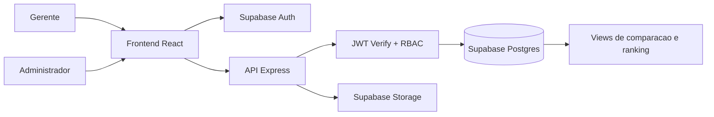

# Documentacao Completa - Estado Atual do Projeto

## 1) Visao geral

Sistema interno da Rede Lamego para controle de compras entre padarias, com foco em:
- reducao de custo
- comparacao de preco por item/produto/loja
- padronizacao de cadastro
- segregacao forte de acesso por perfil

Perfis atuais:
- **Gerente**: acessa somente a propria padaria (lancamentos, historico, alertas, resumo).
- **Administrador**: acessa toda a rede para comparacao, ranking e oportunidades de economia.

Objetivo operacional:
- todas as padarias comprarem no menor preco possivel, com visibilidade de diferencas e desvios.

---

## 2) Stack e estrutura

### Stack
- Frontend: React + Vite
- Backend: Node.js + Express
- Banco: Supabase (PostgreSQL + Auth + Storage + RLS)

### Estrutura de pastas
- `apps/web`: frontend
- `apps/api`: backend
- `packages/shared`: schemas/validacoes compartilhadas
- `infra/supabase/migrations`: migrations SQL e seeds
- `docs`: documentacao

---

## 3) Arquitetura funcional

### Fluxo principal
1. Usuario autentica no Supabase Auth.
2. Frontend recebe sessao/token.
3. API valida token por assinatura (JWKS).
4. API aplica regras de perfil e escopo por loja.
5. Dados sao gravados e comparacoes/alertas atualizados.

---

## 4) Seguranca implementada

### 4.1 Autenticacao
- JWT validado por assinatura com JWKS do Supabase (na API).
- Claims usadas:
  - `app_metadata.role` (`admin` ou `manager`)
  - `user_metadata.store_id` (escopo da loja do gerente)

Arquivo principal:
- `apps/api/src/middleware/auth.js`

### 4.2 Autorizacao e isolamento de loja
- `requireAuth`: bloqueia sem token valido.
- `requireAdmin`: restringe endpoints administrativos.
- `checkStoreScope`: impede gerente de operar outra loja.
- `resolveStoreScope`: para gerente, a loja e sempre a do token.

Resultado esperado:
- gerente nao acessa dados de outra padaria mesmo que tente forcar `storeId`.

### 4.3 Protecoes adicionais
- `helmet` (headers de seguranca)
- `cors` com origem configuravel (`APP_ORIGIN`)
- `express-rate-limit` global
- validacao de input com `zod`
- upload validado para tipos permitidos (`jpg`, `png`, `pdf`)

Arquivo principal:
- `apps/api/src/app.js`

---

## 5) Regras de negocio atuais

## 5.1 Cadastro e padronizacao
- Produtos padronizados por `normalized_name`.
- Categorias ativas em tabela dedicada.
- Fornecedores cadastrados para reuse.

## 5.2 Compras
- Compra possui cabecalho (`purchases`) + itens (`purchase_items`).
- Cada item registra:
  - produto
  - fornecedor
  - valor unitario
  - quantidade
  - unidade utilizada
  - data
  - semana do mes
- Nota fiscal pode ser anexada (storage privado).

## 5.3 Comparacao de preco e eficiencia
- Snapshot por produto: menor, maior e media da rede.
- Ranking de eficiencia por loja baseado em desvio medio.
- Oportunidades admin: quanto cada loja paga acima do melhor preco.

## 5.4 Alertas
- Acima da media da rede.
- Existe preco melhor em outra unidade.

## 5.5 Escopo por perfil
- Gerente:
  - ve somente sua loja
  - lanca compras da propria loja
- Admin:
  - ve toda a rede
  - compara lojas e produtos
  - convida gerente via endpoint dedicado

---

## 6) Frontend (estado atual)

### Rotas
- `/login`: pagina de autenticacao
- `/manager`: painel do gerente (protegido por perfil)
- `/admin`: painel admin (protegido por perfil)

Arquivos:
- `apps/web/src/App.jsx`
- `apps/web/src/pages/LoginPage.jsx`
- `apps/web/src/pages/ManagerPage.jsx`
- `apps/web/src/pages/AdminPage.jsx`
- `apps/web/src/components/ProtectedRoute.jsx`
- `apps/web/src/auth/AuthProvider.jsx`

### Comportamento
- Login via Supabase Auth (`signInWithPassword`).
- Redirecionamento automatico por perfil.
- Manager:
  - resumo da loja
  - alertas da loja
  - historico
  - formulario de novo lancamento
- Admin:
  - lojas da rede
  - ranking
  - oportunidades
  - estatisticas por produto

### Design System (v1)
- Tokens visuais em:
  - `apps/web/src/design-system/tokens.css`
- Estilos globais e layout em:
  - `apps/web/src/styles.css`
- Branding com logo Lamego:
  - via `VITE_BRAND_LOGO_URL` (ou fallback local)

---

## 7) Backend (estado atual)

### Modulos de rota
- `apps/api/src/routes/auth.js`
- `apps/api/src/routes/catalog.js`
- `apps/api/src/routes/purchases.js`
- `apps/api/src/routes/analytics.js`

### Endpoints implementados

#### Health
- `GET /health`

#### Auth
- `POST /auth/login`
- `POST /auth/invite-manager` (admin)

#### Catalogo
- `GET /catalog/products`
- `POST /catalog/products` (admin)
- `GET /catalog/categories`
- `GET /catalog/stores`
- `POST /catalog/stores` (admin)
- `GET /catalog/suppliers`
- `POST /catalog/suppliers`

#### Compras
- `POST /purchases`
- `GET /purchases/store/:storeId`
- `GET /purchases/me` (manager)

#### Analytics / Dashboard / Alertas
- `GET /comparisons/products/:id`
- `GET /dashboards/stores`
- `GET /dashboards/products`
- `GET /dashboards/period?months=6`
- `GET /alerts/me`
- `GET /admin/comparisons/opportunities` (admin)
- `GET /manager/overview`

---

## 8) Banco de dados e migrations

Migrations presentes:
- `001_init_schema.sql`
- `002_indexes_constraints.sql`
- `003_rls_policies.sql`
- `004_views_metrics_alerts.sql`
- `005_seed_products_categories.sql`
- `006_categories_and_product_hardening.sql`
- `007_rls_hardening_and_views.sql`
- `008_mock_data_dev.sql`

Principais objetos:
- Tabelas:
  - `users`
  - `stores`
  - `categories`
  - `products`
  - `suppliers`
  - `purchases`
  - `purchase_items`
  - `fiscal_receipts`
  - `price_snapshots`
  - `alerts`
  - `audit_logs`
- Views/funcoes:
  - `v_product_store_prices`
  - `v_product_price_stats`
  - `v_store_efficiency_ranking`
  - `v_store_product_price_stats`
  - `v_admin_price_opportunities`
  - `fn_period_summary`
  - `fn_week_of_month`

### RLS
- RLS habilitado nas tabelas de dominio.
- Politicas por papel e escopo de loja.

---

## 9) Variaveis de ambiente

Arquivo de referencia:
- `.env.example`

Variaveis backend:
- `SUPABASE_URL`
- `SUPABASE_PUBLISHABLE_KEY`
- `SUPABASE_SERVICE_ROLE_KEY`
- `SUPABASE_JWKS_URL`
- `SUPABASE_DB_PASSWORD`
- `JWT_AUDIENCE`
- `JWT_ISSUER`
- `APP_ORIGIN`
- `PORT`

Variaveis frontend:
- `VITE_SUPABASE_URL`
- `VITE_SUPABASE_PUBLISHABLE_KEY`
- `VITE_API_URL`
- `VITE_BRAND_LOGO_URL`

---

## 10) Como executar hoje

1. Instalar dependencias:
- `npm install`

2. Rodar app completo:
- `npm run dev`

3. Acessos:
- Frontend: `http://localhost:5173`
- Login: `http://localhost:5173/login`
- API: `http://localhost:3333`
- Health: `http://localhost:3333/health`

4. Build:
- `npm run build`

5. Testes:
- `npm run test`

---

## 11) Dados e usuarios de teste

### Dados mockados
- `008_mock_data_dev.sql` cria lojas/compras iniciais para validacao.

### Usuario admin criado no projeto Supabase (estado atual)
- Email: `admin@lamego.local`
- Perfil: `admin` em `app_metadata.role`

Observacao:
- O login admin ja foi validado via `POST /auth/login`.

---

## 12) Auditoria e rastreabilidade

- Acao de criacao em catalogo e compras registra evento em `audit_logs`.
- Objetivo: rastrear quem criou e quando.

---

## 13) Riscos e pontos de atencao atuais

- A tabela `public.users` pode nao existir no ambiente remoto se migrations nao foram aplicadas ainda.
- Interface atual usa JSON em tela para visualizacao rapida; proxima iteracao ideal e tabela/grade visual.
- Fluxo de gerente ainda usa IDs manuais em alguns campos (produto/fornecedor) no formulario atual.

---

## 14) Roadmap tecnico recomendado (proxima iteracao)

1. Aplicar migrations no Supabase remoto e validar schema final.
2. Trocar campos manuais por selects com busca (produto/fornecedor/categoria).
3. Dashboard com componentes de tabela/filtro/grafico.
4. Upload de nota com preview e estado de processamento.
5. E2E completo (login, gerente, admin, escopo).
6. Rotacao de credenciais sensiveis para producao.

---

## 15) Resumo executivo

Hoje o projeto ja possui:
- autenticacao com Supabase
- segregacao por perfil (manager/admin)
- isolamento de dados por loja no backend
- comparacao e ranking de compras
- design system base e identidade visual Lamego
- estrutura pronta para evolucao de UX e operacao em escala

Em termos de arquitetura, o sistema esta funcional e seguro para ambiente interno, com foco claro no objetivo de reduzir custos e equalizar compras da rede.
